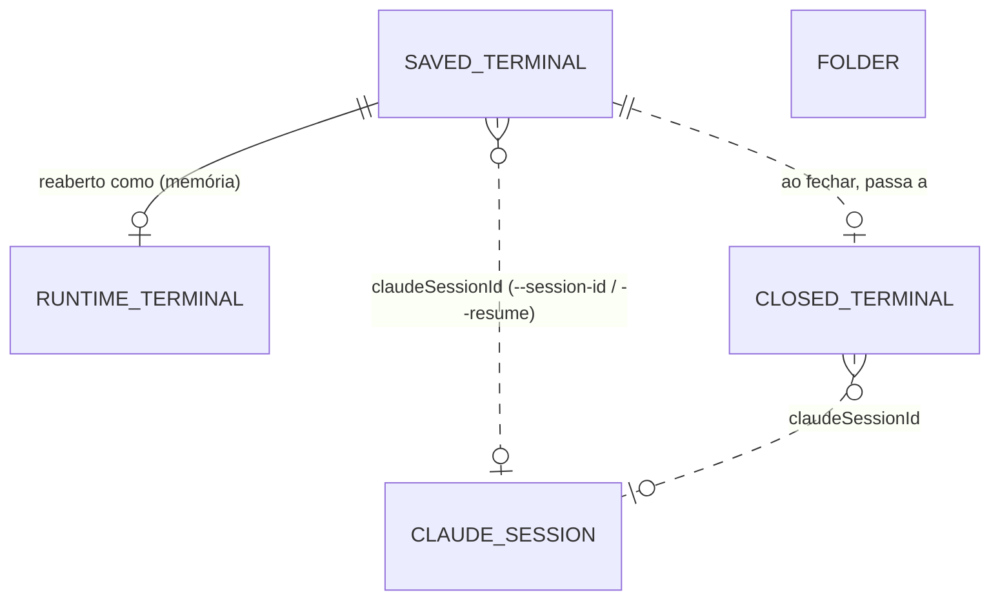

# 🗄️ Base de dados — estado persistido

> ✅ **Modelo decidido a 2026-09-28** (`/design-database`, [[adr/0009-estado-em-ficheiro-json]]) — **sem base
> de dados**: um ficheiro `state.json` escrito só pelo backend. **`StateStore` ✅** (`backend/src/state/`: ler, validar, limites, fila de
> escrita); as coleções ainda não têm quem lhes escreva — chegam com a feature Terminais.
> Migrações: nenhuma — o schema tem `version`; mudanças de schema são funções `migrate(vN → vN+1)` no
> código que o lê, nunca edição à mão de ficheiros antigos.

## O que vive onde

| Dado | Onde | Sobrevive a um reinício? |
|---|---|---|
| Terminais abertos (para reabrir), histórico de fechados, pastas recentes/favoritas | `state.json` em `DATA_DIR` | ✅ |
| Terminal a correr (PTY, estado, código de saída) | memória do backend (`TerminalManager`) | ❌ — o processo morre com o backend |
| Scrollback | memória do backend | ❌ — de propósito: é conteúdo sensível, e a conversa já está no `.jsonl` do Claude Code |
| Sessão de login | memória do backend | ❌ — [[adr/0003-auth-utilizador-unico]] |
| Modo de layout (foco dividido / grelha) | `localStorage` do browser | ✅ por dispositivo |
| Sessões gravadas (`ClaudeSession`) | `~/.claude/projects/` — do Claude Code, **só leitura** | apagadas pelo Claude Code ao fim de 30 dias (`cleanupPeriodDays`) |
| Biblioteca (`LibraryEntry`) | `WORKFLOW_PATH/library` — **só leitura** | — |
| Quota (`UsageSnapshot`) | `DATA_DIR/usage.json` — só o último `rate_limits` visto pela status line de qualquer terminal, com `fetchedAt` ([[adr/0012-argumentos-do-claude-e-status-line]]). Escrito pelo `statusline.cjs`, não pelo `StateStore` | ✅ — mas pode estar velho (sem atividade não se atualiza) |

## O ficheiro

- **Caminho**: `DATA_DIR/state.json`, `DATA_DIR` com omissão `~/.workflow-app/` — **fora do repositório**,
  para nunca ser commitado (tem pastas e resumos de trabalho).
- **Um só escritor**: o backend. Nenhum outro processo o altera (editar à mão só com o backend parado).
- **Ler**: no arranque, validado com zod. Ficheiro inexistente → estado vazio. Ficheiro inválido → o
  backend **não arranca** e diz porquê (nunca o sobrescreve com um estado vazio — perdia-se o histórico).
- **Escrever**: todas as escritas passam por **uma fila** (uma de cada vez, pela ordem); cada uma é
  atómica — escrever `state.json.tmp` e fazer `rename` por cima. No Windows o `rename` pode falhar com
  `EPERM`/`EBUSY` (antivírus, indexador com o ficheiro aberto) → **retry com backoff** curto (ou
  `write-file-atomic`, que já o faz).
- **Formato**:

```json
{
  "version": 1,
  "terminals": [],
  "closedTerminals": [],
  "folders": []
}
```



## Coleções

### Terminal guardado — `SavedTerminal` (`terminals`)

O que representa: um terminal que o utilizador abriu e ainda não fechou — a correr agora, ou **parado**
porque o backend reiniciou.

| Campo | Tipo | Obrigatório | Nota |
|---|---|---|---|
| `id` | uuid | ✅ | Gerado pelo backend; é o mesmo `id` do terminal em memória, e mantém-se ao reabrir |
| `label` | texto ≤ 80 | — | `null` → a UI mostra o nome da pasta |
| `cwd` | texto | ✅ | `realpath`, dentro de `ALLOWED_ROOTS` (revalidado ao reabrir — as raízes podem ter mudado) |
| `claudeSessionId` | uuid | ✅ | Terminal novo: gerado pelo backend e passado com `claude --session-id <uuid>`. Retoma: o uuid da sessão gravada |
| `createdAt` · `updatedAt` · `lastOpenedAt` | instante ISO-8601 | ✅ | `lastOpenedAt` muda a cada Reabrir |

- **Ciclo**: abrir → guardado. Backend reinicia → aparece como **parado**, com **Reabrir** (`claude --resume
  <claudeSessionId>`) e **Reabrir todos**. Nada reabre sozinho (não gasta quota sem pedido).
- **Fechar** → sai de `terminals` e entra em `closedTerminals` (mesmo `id`).
- **Estado a correr/terminado** não se guarda — é da memória (`TerminalManager`); o que não está em memória está parado.

### Terminal fechado — `ClosedTerminal` (`closedTerminals`)

O que representa: o histórico — um terminal que o utilizador fechou, com quando e um resumo curto.

| Campo | Tipo | Obrigatório | Nota |
|---|---|---|---|
| `id` · `label` · `cwd` · `claudeSessionId` | — | como em `SavedTerminal` | Copiados ao fechar |
| `openedAt` | instante | ✅ | O `createdAt` do terminal guardado |
| `closedAt` | instante | ✅ | |
| `summary` | texto ≤ 600 | — | Copiado do `.jsonl` da sessão **no momento de fechar** (o Claude Code apaga-o ao fim de 30 dias) |
| `summarySource` | `ai-title` \| `last-message` \| `null` | — | `ai-title`: o título que o Claude Code gerou; `last-message`: a última mensagem do assistente, cortada; `null`: sessão sem conteúdo ou ilegível |

- **Limite**: os **200 mais recentes** (por `closedAt`); ao entrar o 201.º, sai o mais antigo (hard delete).
- **Ordem**: `closedAt` descendente.
- O resumo **nunca** se obtém escrevendo um prompt no PTY (sujava a conversa gravada, podia interferir
  com uma tarefa ou permissão a meio, e tornava o fecho lento e frágil) — ver ADR 0009.

### Pasta — `Folder` (`folders`)

O que representa: uma pasta usada para abrir terminais, para as sugerir no drawer **Novo terminal**.

| Campo | Tipo | Obrigatório | Nota |
|---|---|---|---|
| `path` | texto | ✅ | `realpath`; **único** |
| `favorite` | bool | ✅ | default `false` |
| `lastUsedAt` | instante | — | Atualizado sempre que se abre um terminal nesta pasta |

- **Recentes**: as não-favoritas, por `lastUsedAt` descendente — ficam as **10** mais recentes; as outras
  saem.
- **Favoritas**: nunca saem nem contam para o limite; desmarcar uma devolve-a às recentes (e ao limite).

## Relações

| De | Para | Cardinalidade | Obrigatória? | Se o "Para" desaparece | Nota |
|---|---|---|---|---|---|
| `SavedTerminal` | terminal em memória | 1:0..1 | não | fica parado | mesmo `id` |
| `SavedTerminal` / `ClosedTerminal` | `ClaudeSession` (`.jsonl`) | N:0..1 | não | Reabrir falha com erro próprio; o histórico fica com o `summary` já copiado | referência fraca a um ficheiro do Claude Code |
| `SavedTerminal` | `Folder` | — | — | — | sem ligação: `cwd` é texto; abrir atualiza a pasta |

## Entidades futuras

- **`Project`** — painel de projetos (ideia, não MVP).
- **Resumo feito pelo Claude** — botão explícito **Resumir** com o terminal vivo, nunca automático
  ([[../notes/ideas|ideas]]). Acrescentaria `summarySource: "claude"`.

## Deixado de fora (deliberadamente)

- **Base de dados (SQLite/Postgres)** — três coleções pequenas, um escritor, sem pesquisa; ver ADR 0009.
  Se o histórico passar a ser ilimitado ou pesquisável, reabrir a decisão (`node:sqlite`, sem binário nativo).
- **Scrollback em disco** — conteúdo sensível; a conversa já fica no `.jsonl`.
- **Preferência de layout no backend** — é do dispositivo; `localStorage`.
- **Apagar entradas do histórico à mão** — não pedido; o limite de 200 chega.
- **Histórico da quota** — só se guarda o último valor (`usage.json`), para o indicador ter o que mostrar depois de um reinício.

## Relacionado

[[architecture]] · [[api]] · [[security]] · [[product/domain-brief]]
